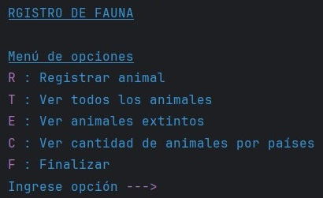
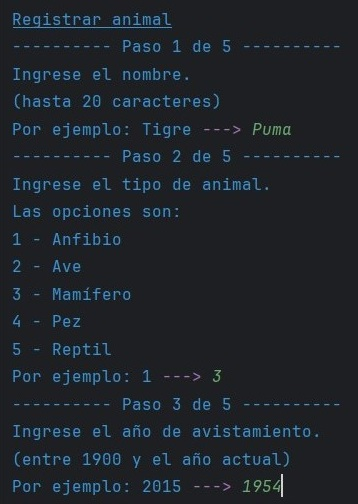
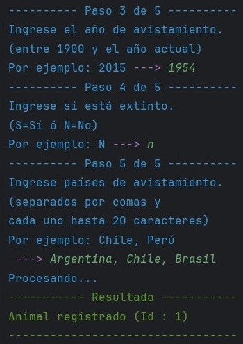
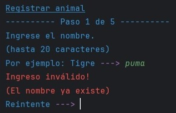
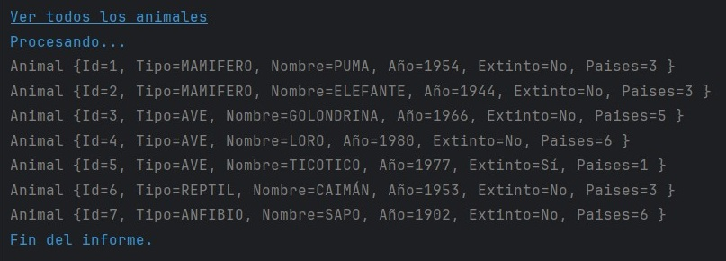

<h1 align="center">Registro de Fauna</h1>

 

## Índice de Contenidos:
---
- [Contexto](#contexto)
- [Guía de Usuario](#guía-de-usuario)
- [Guía de Instalación](#guía-de-instalación)
- [Autor](#autor)
- [Licencia](#licencia)
- [Agradecimientos](#agradecimientos)
- [Documentos Complementarios](#documentos-complementarios)

## Contexto
---
Registro de Fauna es una aplicación desarrollada en Java con el entorno IntelliJ para el curso &quot;Java Persistencia de Datos y Consultas con Spring Data JPA&quot; de ONE + Alura Latam. Ha sido manufacturada por su autor (sin ayuda de IA) en Octubre de 2024.

&#8593; <a href="#readme-indice">Índice</a> &#8593; <a href="#readme-inicio">Inicio</a> &#8593;

## Guía de Usuario
---
Esta aplicación permite registrar avistamientos de animales y luego consultar diferentes informes según los datos almacenados. Para ello, persiste en una base de datos relacional la información suministrada utilizando la tecnología aprendida en el curso.

El modelo de datos es muy sencillo: Se trata de una relación <code>@ManyToMany</code> entre las entidades <code>Animal</code> y <code>Pais</code>.

Para asegurar la consistencia al momento de guardar, se utilizan transacciones de modo manual en los bloques <code>try-catch-finally</code>.

A continuación, unas muestras de su interfaz:

<table align="center" style="border:0">
<tr>
<td align="center"></td>
<td align="center"></td>
</tr>
<tr>
<td align="center"></td>
<td align="center"></td>
</tr>
<tr>
<td align="center" colspan="2"></td>
</tr>
</table>

&#8593; <a href="#readme-indice">Índice</a> &#8593; <a href="#readme-inicio">Inicio</a> &#8593;

## Guía de Instalación
---
Simplemente se requiere clonar este proyecto en el repositorio local, y luego ejecutarlo con un IDE acorde (como IntelliJ, Eclipse, etc) desde el método <code>main</code> de la clase <code>RegistroDeFaunaApplication</code>.

Dado que la aplicación accede a base de datos, es importante asegurar que exista un servidor PostgreSQL 16.4.2 o superior previamente instalado, y que tanto antivirus como cortafuegos no impidan dicho comportamiento.

Importante: No olvidar declarar las variables de entorno que se utilizan en <code>application.properties</code>.

## Autor
---
César es alumno de Alura. Inició su formación en Junio de 2024 dentro del plan Oracle Next Education para Latinoamérica. Tiene 54 años y es nacido en Buenos Aires.

&#8593; <a href="#readme-indice">Índice</a> &#8593; <a href="#readme-inicio">Inicio</a> &#8593;

## Licencia 
---
Licencia BSD Zero Clause (0BSD) detallada en <code>LICENSE.txt</code> en la raíz del repositorio. Más información en https://opensource.org/license/0bsd

&#8593; <a href="#readme-indice">Índice</a> &#8593; <a href="#readme-inicio">Inicio</a> &#8593;

## Agradecimientos 
---
* Generador de logotipo : https://logomakerr.ai/
* Generador de favicon : https://favicon.io/

&#8593; <a href="#readme-indice">Índice</a> &#8593; <a href="#readme-inicio">Inicio</a> &#8593;

## Documentos Complementarios
---
* Clonar un repositorio de GitHub : https://docs.github.com/es/repositories/creating-and-managing-repositories/cloning-a-repository
* Scripts SQL de base de datos :  https://github.com/cesargh/registro-de-fauna/tree/master/sql
* Sito Web Oficial de PostgreSQL : https://www.postgresql.org

&#8593; <a href="#readme-indice">Índice</a> &#8593; <a href="#readme-inicio">Inicio</a> &#8593;

